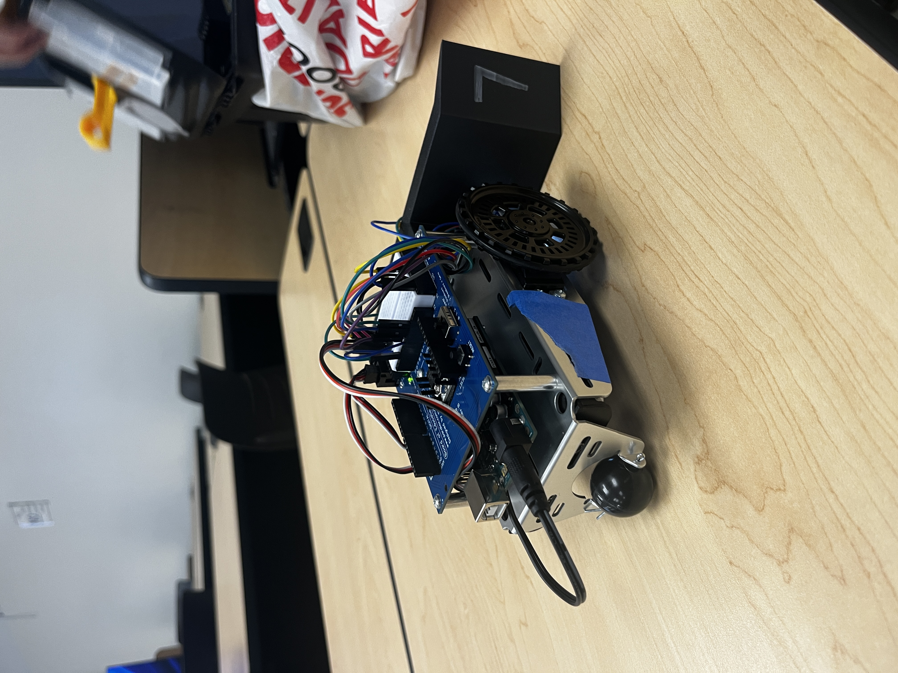
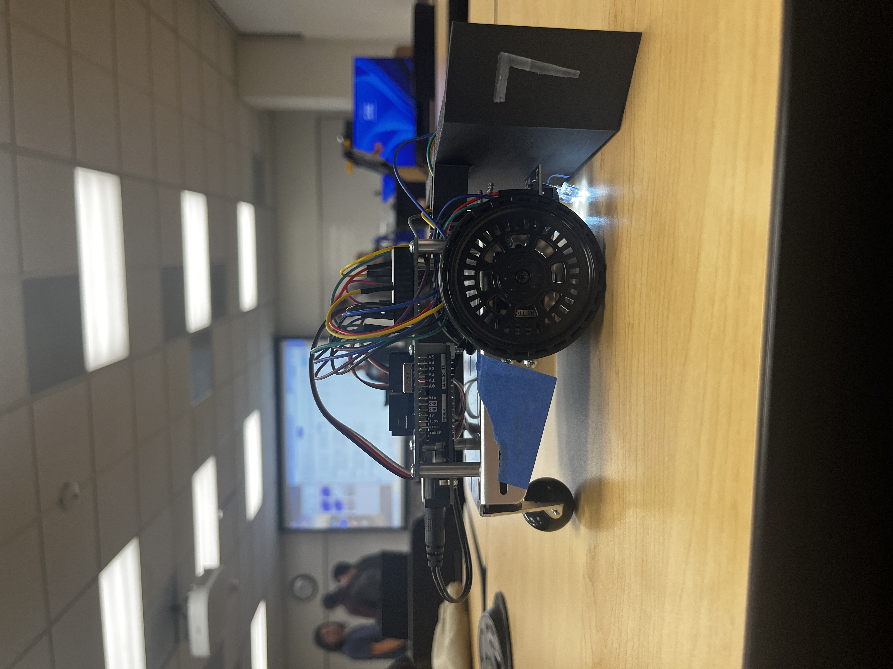
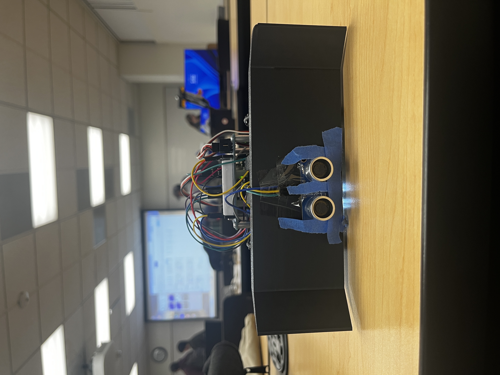
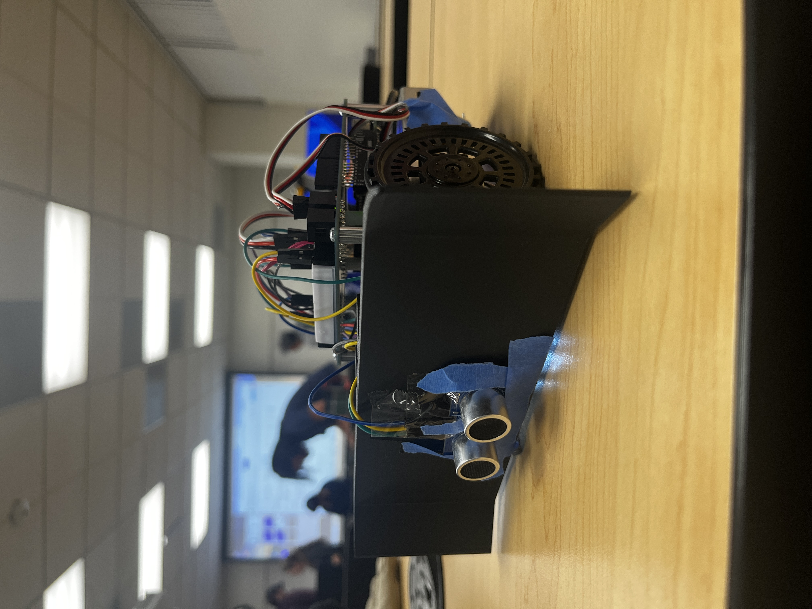
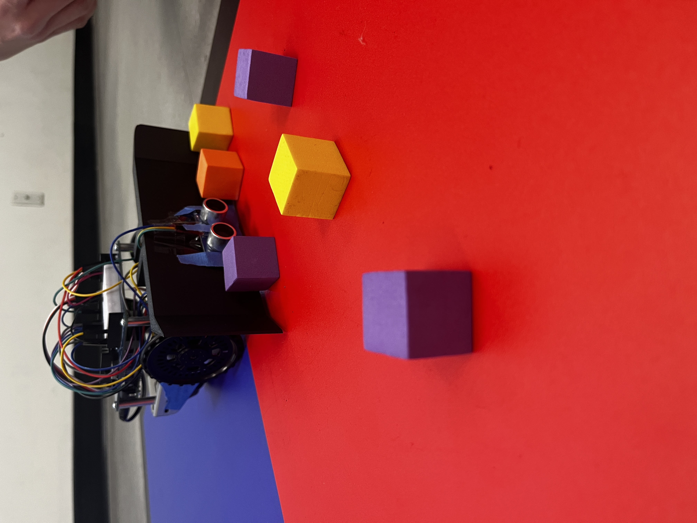
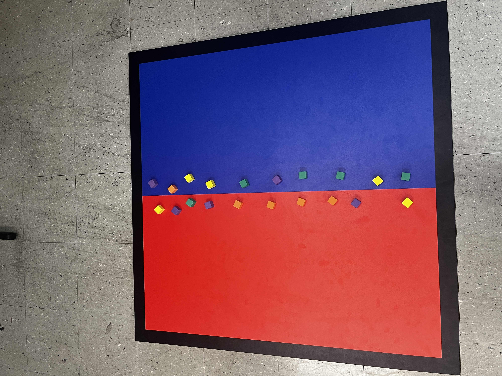

# Jose Reyes – Engineering Portfolio

Welcome to my engineering portfolio. This shows my work on autonomous robotic systems, with a focus on sensing, control, and mechanical integration. The primary project highlighted here is **PlowZilla**, an autonomous robot designed for the EGME 456 Messy Room Competition.

---

## 🔧 Project: PlowZilla – Messy Room Competition Robot

### Course
**EGME 456 – Introduction to Mechatronics**  
California State University, Fullerton  
Instructor: Dr. Weiss  

### Team
- Katia Maldonado  
- Isaac Hernandez  
- Jose Reyes  

---

## 📌 Project Objective
Design and program an autonomous robot capable of clearing 1 in × 1 in foam blocks from its assigned side of a 4 ft × 4 ft field within a 60-second match. The robot must:
- Detect field boundaries
- Identify its assigned side (red or blue)
- Locate and push blocks efficiently
- Operate fully autonomously

---

## 🧠 System Overview

### Mechanical System
- Aluminum chassis provided by course kit  
- Two Parallax continuous rotation servos (rear-wheel drive)  
- 3D-printed bulldozer plow designed in SolidWorks  
- Plow geometry optimized to guide blocks outward and toward the opponent side  

### Electrical System
- Arduino Uno as main controller  
- Power supplied by AA battery pack and 9V battery  
- Sensors:
  - QTI sensor for black border detection
  - TCS3200 color sensor for side identification
  - Ultrasonic sensor for block detection  

### Software System
- State-based control architecture:
  - **Roam** – patrol and search for blocks
  - **Push** – drive forward to move blocks
  - **Retreat** – back away and reorient
- Priority-based safety handling for boundary detection
- Timing-based logic for reliability and simplicity

---

## 🧭 Sensing and Control Strategy
- **Color sensor** determines the robot’s home side at startup and prevents pushing while on the opponent’s side  
- **QTI sensor** continuously monitors the black border and overrides all behaviors to prevent leaving the field  
- **Ultrasonic sensor** detects blocks within a threshold distance and triggers pushing behavior  
- Differential drive control using two continuous rotation servos

  I implemented and refined the control logic that integrates the  TCS3200 color sensor and ultrasonic sensor. The robot operates using a state-based architecture (roam, push, retreat), with boundary detection overriding all behaviors to prevent out-of-bounds conditions. Timing-based control was chosen over PID for simplicity and reliability under competition constraints.

---

## 🧪 Testing and Performance
- Bench-tested individual sensors using serial output for calibration
- Validated drivetrain motion and turning behavior
- Tested block-pushing reliability with different cube orientations
- Competition performance improved significantly after software revisions
- Final placement: **3rd overall**

---

## 📈 Design Process & Iteration
The design evolved through multiple iterations:
- Initial focus on random movement shifted to a controlled perimeter sweep strategy
- Plow geometry refined to reduce block jamming
- Software simplified to favor reliability over complexity
- Ultrasonic sensor behavior corrected to prevent avoidance of blocks
Testing heavily influenced final timing values and state transitions.

I primarily worked on software development and sensor integration, focusing on ultrasonic sensing, boundary detection logic, and state-based control. Early iterations revealed instability caused by aggressive turning and inconsistent ultrasonic readings. Through repeated testing, I refined timing-based logic, simplified behaviors, and improved reliability by prioritizing boundary avoidance and controlled sweeping over complex path planning.

---

## 🧠 Reflection
This project strengthened my skills in:
- Embedded programming and debugging
- Sensor integration and calibration
- Mechanical design for real-world constraints
- Trade-off analysis between speed, stability, and reliability  

This project reinforced the importance of reliability over complexity in autonomous systems. While advanced behaviors were initially attempted, the most successful solution was a simplified sweep strategy with strong boundary awareness. If given more time, I would further refine navigation patterns and improve ultrasonic robustness. Overall, the project strengthened my skills in debugging embedded systems and integrating mechanical and software design.

---

   
 

---

## 🌐 Live Portfolio
🔗 **GitHub Pages Portfolio:**  
[https://jose-reyes-me.github.io](https://github.com/jose-reyes-me/projects)

---

## 📬 Contact
**Jose Reyes**  
Mechanical Engineering  
California State University, Fullerton  

